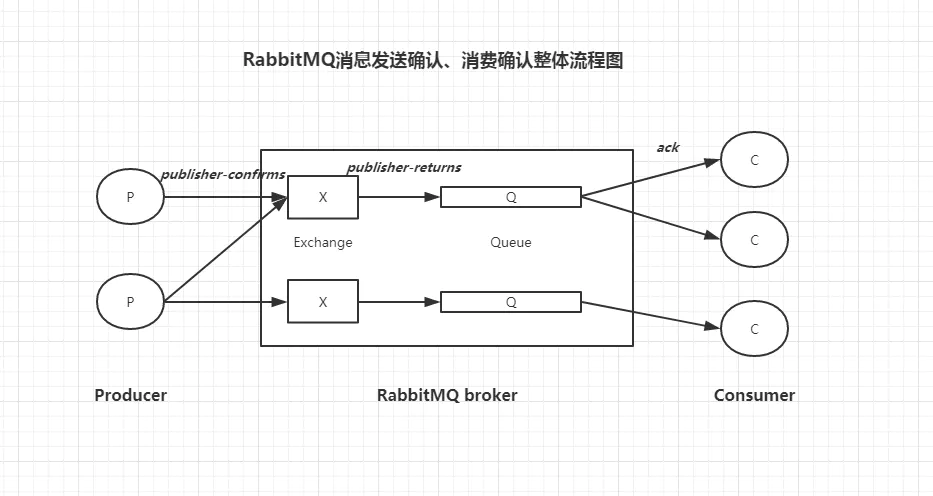

#springboot + rabbitmq发送邮件(保证消息100%投递成功并被消费)


RabbitMQ相关知识请参考: https://www.jianshu.com/p/cc3d2017e7b3

inux安装RabbitMQ请参考: https://www.jianshu.com/p/ee9f7594212b

Windows安装RabbitMQ请参考: https://www.jianshu.com/p/c7726ba4b046



消息发送确认机制

消费确认机制

消息的重新投递

消费幂等性, 等等

###实现思路
```aidl
简略介绍163邮箱授权码的获取
编写发送邮件工具类
编写RabbitMQ配置文件
生产者发起调用
消费者发送邮件
定时任务定时拉取投递失败的消息, 重新投递
各种异常情况的测试验证
拓展: 使用动态代理实现消费端幂等性验证和消息确认(ack)

```

